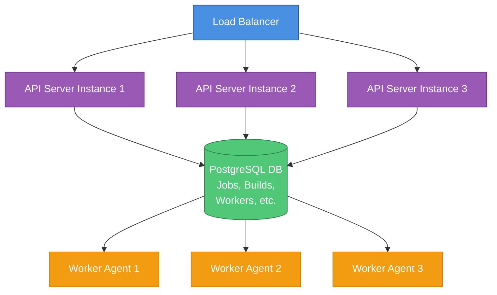
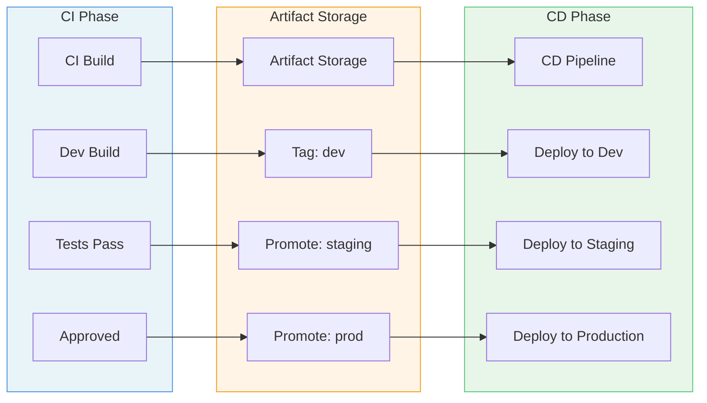

# Ritmo Architecture

## System Overview



## Component Details

### API Server

**Responsibilities:**
- Job scheduling and queuing
- Worker registration and health monitoring
- Build lifecycle management
- Plugin loading and management
- Artifact metadata tracking
- Authentication and authorization
- Webhook handling (Git, external triggers)

**Technologies:**
- Go for high performance and concurrency
- gRPC for worker communication
- REST API for UI and CLI
- Plugin system using Go plugins or WASM

**Key Modules:**
- `scheduler`: Job queue and worker assignment
- `orchestrator`: Build execution workflow
- `plugin-manager`: Plugin discovery, loading, lifecycle
- `worker-manager`: Worker registration, heartbeat, capacity
- `artifact-manager`: Artifact storage coordination
- `auth`: Authentication, authorization, RBAC
- `webhook`: SCM webhook handlers

### Database Layer

**Schema Design:**

**Jobs Table:**
- Job configuration (SCM, build steps, triggers)
- Pipeline definition (stages, dependencies)
- Scheduling configuration (cron, manual, webhook)
- Plugin references

**Builds Table:**
- Build instance data
- Status, timestamps, duration
- Worker assignment
- Logs and artifacts references
- Environment variables and parameters

**Workers Table:**
- Worker registration info
- Capacity (CPU, memory, concurrent jobs)
- Labels and tags for targeting
- Health status and last heartbeat
- Current job assignments

**Artifacts Table:**
- Artifact metadata
- Storage location (plugin-specific)
- Version and checksums
- Promotion status (dev → staging → prod)

**Deployments Table:**
- CD deployment records
- Target environment
- Deployment status and rollback info
- Link to source build

### Worker Agent

**Responsibilities:**
- Register with API server
- Poll for assigned jobs (or receive via gRPC stream)
- Execute build in isolated environment
- Stream logs to API server
- Report build status and metrics
- Upload artifacts
- Clean up build environment

**Isolation Strategies:**
- Docker containers (primary)
- Kubernetes pods (for K8s deployments)
- VMs (for maximum isolation)
- Process isolation (lightweight)

**Build Execution Flow:**
1. Receive job from API server
2. Pull source code (via SCM plugin)
3. Setup build environment (container/VM)
4. Execute build steps
5. Collect artifacts
6. Upload artifacts (via storage plugin)
7. Cleanup environment
8. Report completion

### Web UI

**Dashboard Views:**
- **Overview**: Active jobs, recent builds, system health
- **Jobs**: List all jobs, create/edit/delete
- **Builds**: Build history, filter, search
- **Workers**: Worker fleet status, capacity, utilization
- **Pipelines**: Visual pipeline editor
- **Artifacts**: Artifact browser and promotion
- **Deployments**: CD deployment tracking
- **Analytics**: Build duration trends, success rate, bottlenecks
- **Plugins**: Installed plugins, marketplace
- **Settings**: System configuration, users, permissions

**Real-time Features:**
- WebSocket for live build logs
- Server-Sent Events for build status updates
- Live worker status monitoring

### Plugin System

**Plugin Types:**

1. **SCM Plugins**: Git, GitHub, GitLab, Bitbucket, SVN
2. **Build Tools**: Maven, Gradle, npm, pip, cargo, go build
3. **Test Runners**: JUnit, pytest, Jest, Go test
4. **Artifact Storage**: S3, GCS, Artifactory, Nexus, local
5. **Notifications**: Slack, Email, Teams, PagerDuty
6. **Deployment**: Kubernetes, Docker, SSH, ArgoCD, Spinnaker
7. **Security Scanning**: SonarQube, Snyk, Trivy
8. **Custom Triggers**: Cron, external events, manual

**Plugin Interface (Go):**

```go
type Plugin interface {
    Name() string
    Version() string
    Initialize(config map[string]interface{}) error
    Execute(context *ExecutionContext) (*Result, error)
    Cleanup() error
}
```

**Binary Plugin Loading:**
- Go plugins (`.so` files on Linux/Mac, `.dll` on Windows)
- WASM modules (portable, sandboxed)
- gRPC-based plugins (language-agnostic)

## CI/CD Separation

### CI Phase
- Triggered by code commits, PRs, schedules
- Run tests, static analysis, security scans
- Build artifacts
- Tag artifacts with metadata (commit SHA, version, etc.)
- Store in artifact repository
- Emit events for CD system

### CD Phase
- Triggered by CI completion or manual approval
- Pull artifacts from repository
- Deploy to target environment
- Run integration tests, smoke tests
- Rollback capability
- Deployment verification

### Artifact Promotion Flow



### External CD Integration

**GitHub Actions Integration:**
- CI phase creates artifact
- Triggers GitHub workflow dispatch
- Passes artifact location and metadata
- GitHub Actions handles deployment

**ArgoCD Integration:**
- CI phase updates Git repo (GitOps)
- ArgoCD detects change
- ArgoCD deploys to Kubernetes
- Ritmo tracks deployment status via ArgoCD API

## Scalability Considerations

### API Server Scaling
- Stateless design (all state in DB)
- Connection pooling for database
- Caching layer (Redis) for hot data
- Rate limiting and throttling
- Horizontal pod autoscaling (K8s)

### Worker Scaling
- Auto-scaling based on queue depth
- Spot instances for cost optimization
- Multiple worker pools (different capabilities)
- Graceful shutdown with job draining

### Database Scaling
- Read replicas for query scaling
- Connection pooling
- Partitioning for large tables (builds, logs)
- Archival strategy for old builds

## Security

- **Authentication**: OAuth2, SAML, LDAP
- **Authorization**: Role-based access control (RBAC)
- **Secrets Management**: Vault integration, encrypted storage
- **Network Security**: TLS for all communication
- **Build Isolation**: Container/VM isolation
- **Audit Logging**: All actions logged

## Observability

### Metrics
- Build queue depth
- Worker utilization
- Build duration (p50, p95, p99)
- Success/failure rate
- API latency
- Database connection pool stats

### Logging
- Structured JSON logs
- Correlation IDs across services
- Log aggregation (ELK, Loki)

### Tracing
- Distributed tracing with OpenTelemetry
- Trace build execution flow
- Performance bottleneck identification
