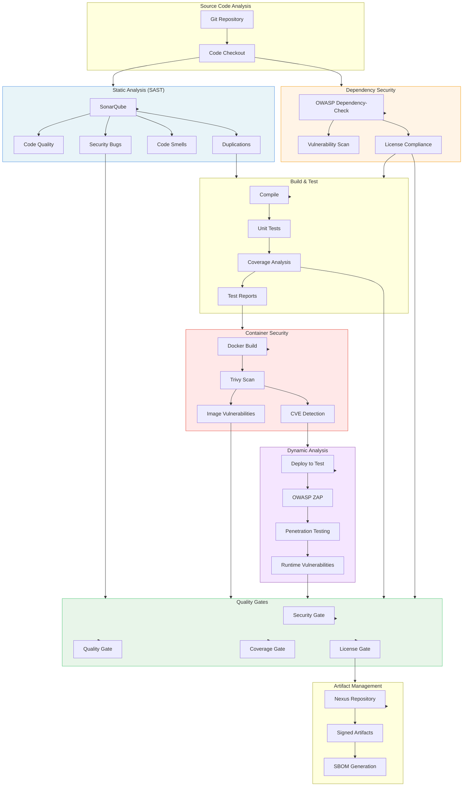

# Enterprise Security & Quality Gates

This document outlines Ritmo's comprehensive enterprise-grade security, quality, and compliance capabilities designed for production environments.

## Architecture Overview



## Enterprise Plugin Ecosystem

### 1. Static Application Security Testing (SAST)

#### SonarQube Integration

**Purpose**: Comprehensive code quality and security analysis

**Features**:
- **Code Quality**: Bugs, code smells, maintainability issues
- **Security Vulnerabilities**: SQL injection, XSS, hardcoded secrets
- **Code Coverage**: Line, branch, and condition coverage
- **Technical Debt**: Estimation and tracking
- **Duplicate Code Detection**: Identifies code clones

**Configuration**:

```yaml
plugins:
  - name: sonarqube-sast
    type: security
    config:
      server_url: http://sonarqube:9000
      token: ${SONAR_TOKEN}
      project_key: my-project
      organization: my-org
      quality_gate: "Sonar way"
      timeout: 300
```

**Quality Gate Rules**:
- **Coverage**: >= 80%
- **Duplications**: <= 3%
- **Bugs**: 0 (blocker/critical)
- **Vulnerabilities**: 0 (blocker/critical)
- **Code Smells**: <= 5 (blocker/critical)
- **Security Rating**: A or B
- **Reliability Rating**: A or B
- **Maintainability Rating**: A or B

**Metrics Tracked**:
- Lines of Code (LoC)
- Cyclomatic Complexity
- Cognitive Complexity
- Technical Debt Ratio
- Coverage (unit, integration)
- Security Hotspots

### 2. Container Security Scanning

#### Trivy Scanner

**Purpose**: Vulnerability detection in container images

**Features**:
- **OS Package Vulnerabilities**: Detects CVEs in OS packages
- **Language Libraries**: Scans application dependencies
- **Misconfiguration Detection**: Identifies security misconfigurations
- **Secret Scanning**: Finds hardcoded secrets in images
- **SBOM Generation**: Creates Software Bill of Materials

**Configuration**:

```yaml
plugins:
  - name: trivy-container-scan
    type: security
    config:
      image: myapp:latest
      severity: [CRITICAL, HIGH]
      ignore_unfixed: true
      timeout: 300
      exit_code: 1  # Fail build on vulnerabilities
```

**Severity Levels**:
- **CRITICAL**: CVSS >= 9.0 - Immediate action required
- **HIGH**: CVSS 7.0-8.9 - Fix within 24-48 hours
- **MEDIUM**: CVSS 4.0-6.9 - Fix within 1 week
- **LOW**: CVSS 0.1-3.9 - Fix in next release

**Vulnerability Databases**:
- NVD (National Vulnerability Database)
- Red Hat Security Data
- Debian Security Tracker
- Ubuntu Security Notices
- Alpine SecDB

### 3. Dynamic Application Security Testing (DAST)

#### OWASP ZAP

**Purpose**: Runtime security testing of deployed applications

**Features**:
- **Spider**: Discovers all application endpoints
- **Active Scanning**: Tests for vulnerabilities
- **Passive Scanning**: Monitors traffic for issues
- **Authentication**: Tests authenticated endpoints
- **API Testing**: REST/GraphQL API security

**Configuration**:

```yaml
plugins:
  - name: owasp-zap-dast
    type: security
    config:
      zap_url: http://owasp-zap:8080
      api_key: ${ZAP_API_KEY}
      target_url: https://staging.myapp.com
      scan_type: full  # baseline, full, api
      timeout: 600
      alert_level: High
      fail_on_alert: true
```

**Vulnerability Types Detected**:
- SQL Injection
- Cross-Site Scripting (XSS)
- Cross-Site Request Forgery (CSRF)
- Insecure Direct Object References
- Security Misconfiguration
- Sensitive Data Exposure
- XML External Entities (XXE)
- Broken Authentication
- Broken Access Control

**OWASP Top 10 Coverage**: 100%

### 4. Dependency Security Scanning

#### OWASP Dependency-Check

**Purpose**: Identifies known vulnerabilities in project dependencies

**Features**:
- **Multi-Language Support**: Java, .NET, JavaScript, Python, Ruby, Go
- **CVE Detection**: Matches dependencies against NVD
- **CPE Analysis**: Common Platform Enumeration matching
- **Suppression Files**: False positive management
- **CVSS Scoring**: Risk-based prioritization

**Configuration**:

```yaml
plugins:
  - name: owasp-dependency-check
    type: security
    config:
      scan_path: .
      format: JSON
      fail_on_cvss: 7.0  # HIGH severity
      suppression_file: dependency-check-suppressions.xml
      enable_experimental: true
```

**Supported Ecosystems**:
- Maven (Java)
- NPM/Yarn (JavaScript/TypeScript)
- PyPI (Python)
- NuGet (.NET)
- RubyGems (Ruby)
- Go modules
- Composer (PHP)
- CocoaPods (Swift/Objective-C)

### 5. Test Framework Integration

#### JUnit Test Reporter

**Purpose**: Aggregates and reports test results

**Features**:
- **Multi-Framework**: JUnit, TestNG, pytest, Jest, Go test
- **Coverage Analysis**: Line, branch, statement coverage
- **Trend Analysis**: Test success rate over time
- **Failure Categorization**: Flaky tests, consistent failures
- **Performance Metrics**: Test execution time

**Configuration**:

```yaml
plugins:
  - name: junit-test-reporter
    type: test
    config:
      report_path: "**/target/surefire-reports/TEST-*.xml"
      fail_on_failures: true
      fail_on_errors: true
      coverage_enabled: true
      coverage_min: 80.0
```

**Report Includes**:
- Total tests: Passed/Failed/Skipped
- Duration: Test execution time
- Coverage: Line and branch coverage
- Trends: Historical success rate
- Failed Tests: Stack traces and messages

### 6. License Compliance

#### License Compliance Scanner

**Purpose**: Ensures all dependencies comply with license policies

**Features**:
- **License Detection**: Identifies all dependency licenses
- **Policy Enforcement**: Allows/denies specific licenses
- **Attribution Generation**: Creates NOTICES file
- **Multi-Ecosystem**: NPM, Maven, PyPI, Go

**Configuration**:

```yaml
plugins:
  - name: license-compliance-scanner
    type: security
    config:
      allowed_licenses:
        - MIT
        - Apache-2.0
        - BSD-3-Clause
        - ISC
      denied_licenses:
        - GPL-2.0
        - GPL-3.0
        - AGPL-3.0
        - SSPL
      require_attribution: true
      fail_on_denied: true
      fail_on_unknown: false
```

**License Categories**:
- **Permissive**: MIT, Apache-2.0, BSD
- **Weak Copyleft**: LGPL, MPL
- **Strong Copyleft**: GPL, AGPL (typically denied)
- **Proprietary**: Commercial licenses
- **Public Domain**: Unlicense, CC0

## Enterprise Pipeline Example

### Full Security Pipeline

```yaml
apiVersion: ritmo.dev/v1
kind: Job
metadata:
  name: enterprise-secure-build
spec:
  pipeline:
    stages:
      # Stage 1: Code Quality & SAST
      - name: static-analysis
        steps:
          - plugin: sonarqube-sast
            config:
              server_url: http://sonarqube:9000
              token: ${SONAR_TOKEN}
              project_key: my-app
              quality_gate: "Enterprise Quality Gate"
      
      # Stage 2: Dependency Security
      - name: dependency-scan
        depends_on: [static-analysis]
        steps:
          - plugin: owasp-dependency-check
            config:
              fail_on_cvss: 7.0
          
          - plugin: license-compliance-scanner
            config:
              fail_on_denied: true
      
      # Stage 3: Build & Test
      - name: build-and-test
        depends_on: [dependency-scan]
        steps:
          - plugin: maven-build
            config:
              goals: [clean, package]
          
          - plugin: junit-test-reporter
            config:
              coverage_min: 80.0
      
      # Stage 4: Container Security
      - name: container-security
        depends_on: [build-and-test]
        steps:
          - plugin: docker-build
            config:
              image: myapp:${BUILD_NUMBER}
          
          - plugin: trivy-container-scan
            config:
              image: myapp:${BUILD_NUMBER}
              severity: [CRITICAL, HIGH]
              fail_on_high: true
      
      # Stage 5: DAST (only on staging)
      - name: dynamic-security
        depends_on: [container-security]
        condition: branch == 'main'
        steps:
          - plugin: deploy-to-staging
            config:
              environment: staging
          
          - plugin: owasp-zap-dast
            config:
              target_url: https://staging.myapp.com
              scan_type: full
      
      # Stage 6: Artifact Publishing
      - name: publish
        depends_on: [dynamic-security]
        steps:
          - plugin: nexus-artifact
            config:
              repository: releases
              sign: true
          
          - plugin: sbom-generator
            config:
              format: CycloneDX
```

## Quality Gates Configuration

### Enterprise Quality Gate Matrix

| Metric | Threshold | Severity | Blocker |
|--------|-----------|----------|---------|
| Critical Security Issues | 0 | Critical | Yes |
| High Security Issues | 0 | Critical | Yes |
| Critical Bugs | 0 | High | Yes |
| Code Coverage | >= 80% | High | Yes |
| Duplicated Code | <= 3% | Medium | No |
| Maintainability Rating | A or B | Medium | No |
| Security Rating | A | Critical | Yes |
| Reliability Rating | A or B | High | Yes |
| Container CVE (Critical) | 0 | Critical | Yes |
| Container CVE (High) | <= 5 | High | No |
| License Violations | 0 | Critical | Yes |
| Unknown Licenses | 0 | Medium | No |

### Gate Enforcement Levels

**Level 1: Development** (Minimal)
- Block on critical security issues only
- Warn on quality issues
- Required coverage: 60%

**Level 2: Staging** (Standard)
- Block on high+ security issues
- Block on failed tests
- Required coverage: 75%
- License compliance check

**Level 3: Production** (Strict)
- Block on all security gates
- Block on quality gates
- Required coverage: 80%
- Full DAST scan required
- Signed artifacts required

## Infrastructure Setup

### Start Enterprise Stack

```bash
# Start all enterprise services
docker-compose -f docker-compose.enterprise.yml up -d

# Verify services
docker-compose -f docker-compose.enterprise.yml ps

# Check service health
docker-compose -f docker-compose.enterprise.yml exec sonarqube curl -f http://localhost:9000/api/system/status
docker-compose -f docker-compose.enterprise.yml exec trivy-server wget --spider -q http://localhost:8080/healthz
docker-compose -f docker-compose.enterprise.yml exec owasp-zap curl -f http://localhost:8080
```

### Service URLs

| Service | URL | Default Credentials |
|---------|-----|---------------------|
| SonarQube | http://localhost:9090 | admin/admin |
| Nexus | http://localhost:8083 | admin/admin123 |
| OWASP ZAP | http://localhost:8081 | API Key: ritmo-zap-api-key |
| Trivy Server | http://localhost:8082 | N/A |
| Grafana | http://localhost:3001 | admin/admin |
| Prometheus | http://localhost:9091 | N/A |
| Vault | http://localhost:8200 | Token: ritmo-dev-token |

### Initial Configuration

#### SonarQube Setup

```bash
# Generate token
curl -u admin:admin -X POST 'http://localhost:9090/api/user_tokens/generate?name=ritmo-token'

# Create quality gate
curl -u admin:admin -X POST 'http://localhost:9090/api/qualitygates/create?name=Enterprise%20Quality%20Gate'

# Set conditions
curl -u admin:admin -X POST 'http://localhost:9090/api/qualitygates/create_condition' \
  -d 'gateId=1' \
  -d 'metric=new_coverage' \
  -d 'op=LT' \
  -d 'error=80'
```

#### Trivy Server Setup

```bash
# Update vulnerability database
docker-compose -f docker-compose.enterprise.yml exec trivy-server trivy image --download-db-only
```

#### OWASP ZAP Setup

```bash
# Set API key
export ZAP_API_KEY=ritmo-zap-api-key

# Verify connection
curl -X GET "http://localhost:8081/JSON/core/view/version/?apikey=${ZAP_API_KEY}"
```

## Security Best Practices

### 1. Secret Management

- Store all secrets in Vault or environment variables
- Never commit secrets to Git
- Rotate credentials regularly
- Use least-privilege access

### 2. Vulnerability Management

- **Critical**: Patch within 24 hours
- **High**: Patch within 7 days
- **Medium**: Patch within 30 days
- **Low**: Patch in next release

### 3. Compliance & Auditing

- Maintain audit logs for all scans
- Generate compliance reports monthly
- Track vulnerability trends
- Document exceptions/suppressions

### 4. Continuous Improvement

- Review quality gates quarterly
- Update vulnerability databases weekly
- Tune false positives
- Train developers on secure coding

## Reporting & Metrics

### Security Dashboard Metrics

1. **Vulnerability Trends**
   - Critical/High CVEs over time
   - Mean Time to Remediation (MTTR)
   - Vulnerability density (per 1000 LoC)

2. **Quality Metrics**
   - Code coverage trends
   - Technical debt ratio
   - Bug density
   - Code duplication percentage

3. **Compliance Metrics**
   - License compliance rate
   - Policy violations
   - Security gate pass rate
   - SBOM generation status

4. **Performance Metrics**
   - Scan duration
   - Build success rate
   - Time to production
   - Deployment frequency

### Sample Report Structure

```markdown
## Monthly Security Report

### Executive Summary
- Total Scans: 1,245
- Security Issues Found: 89
- Critical Issues: 0
- High Issues: 3 (all remediated)
- Quality Gate Pass Rate: 98.4%

### Trends
- 15% reduction in vulnerabilities month-over-month
- Code coverage improved from 78% to 82%
- MTTR decreased from 5 days to 2 days

### Top Risks
1. Outdated dependency X (HIGH - CVE-2024-12345)
2. Insufficient test coverage in Module Y
3. 3 unknown licenses in new dependencies

### Recommendations
1. Upgrade dependency X to version 2.1.0
2. Add unit tests for Module Y
3. Review and approve new dependency licenses
```

## Troubleshooting

### Common Issues

**SonarQube Analysis Fails**
```bash
# Check logs
docker logs ritmo-sonarqube

# Increase memory
# Edit docker-compose.enterprise.yml
environment:
  SONAR_WEB_JAVAADDITIONALOPTS: "-Xmx2g"
```

**Trivy Scan Timeout**
```bash
# Increase timeout in plugin config
timeout: 600

# Use Trivy server mode
server_url: http://trivy-server:8080
```

**ZAP Spider Not Finding Pages**
```bash
# Enable authentication
# Provide session token or credentials in config
```

## Integration with CI/CD

### GitHub Actions Example

```yaml
name: Enterprise Security Scan

on: [push, pull_request]

jobs:
  security-scan:
    runs-on: ubuntu-latest
    steps:
      - uses: actions/checkout@v3
      
      - name: Trigger Ritmo Build
        run: |
          curl -X POST http://ritmo-server:8080/api/v1/jobs/my-app/trigger \
            -H "Authorization: Bearer ${RITMO_TOKEN}"
      
      - name: Wait for Results
        run: |
          # Poll for build status
          # Fail if security gates not passed
```

## Conclusion

Ritmo's enterprise plugin architecture provides comprehensive security, quality, and compliance capabilities while maintaining a clean, extensible core. All security tools are implemented as plugins, allowing teams to customize their security posture based on organizational requirements.

For additional plugins or custom integrations, refer to the [Plugin Development Guide](../plugin-sdk/README.md).
