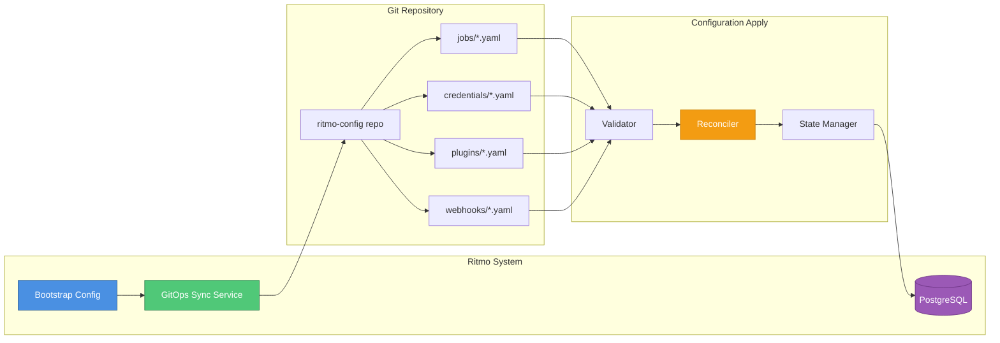

# GitOps Configuration for Ritmo

Ritmo supports GitOps-based configuration management, where all configuration (jobs, credentials, plugins, webhooks) is stored in a Git repository and automatically synchronized.

## Architecture



## Bootstrap Configuration

Ritmo is bootstrapped with minimal configuration to connect to the GitOps repository:

### Environment Variables

```bash
# GitOps Configuration Repository
RITMO_GITOPS_ENABLED=true
RITMO_GITOPS_REPO_URL=https://github.com/myorg/ritmo-config
RITMO_GITOPS_REPO_BRANCH=main
RITMO_GITOPS_REPO_PATH=/  # Root path in repo
RITMO_GITOPS_SYNC_INTERVAL=60  # seconds

# GitOps Authentication
RITMO_GITOPS_AUTH_TYPE=token  # token, ssh, app
RITMO_GITOPS_TOKEN=ghp_xxxxxxxxxxxx  # GitHub PAT
# OR for SSH:
# RITMO_GITOPS_SSH_KEY_PATH=/etc/ritmo/gitops-key
# OR for GitHub App:
# RITMO_GITOPS_APP_ID=123456
# RITMO_GITOPS_APP_PRIVATE_KEY_PATH=/etc/ritmo/app-key.pem
# RITMO_GITOPS_INSTALLATION_ID=987654

# GitOps Behavior
RITMO_GITOPS_AUTO_APPLY=true  # Auto-apply changes
RITMO_GITOPS_DRY_RUN=false    # Preview changes only
RITMO_GITOPS_PRUNE=true       # Delete resources not in Git
```

### Bootstrap File (`/etc/ritmo/gitops-bootstrap.yaml`)

```yaml
gitops:
  enabled: true
  
  repository:
    url: https://github.com/myorg/ritmo-config
    branch: main
    path: /
    
  authentication:
    type: token  # token, ssh, github_app
    token: ${RITMO_GITOPS_TOKEN}  # From environment or secret manager
    # OR
    # ssh_key_path: /etc/ritmo/gitops-key
    # OR
    # github_app:
    #   app_id: 123456
    #   installation_id: 987654
    #   private_key_path: /etc/ritmo/app-key.pem
  
  sync:
    interval: 60  # seconds
    auto_apply: true
    dry_run: false
    prune: true  # Remove resources not in Git
    
  # Webhook for instant sync (optional)
  webhook:
    enabled: true
    secret_token: ${RITMO_GITOPS_WEBHOOK_SECRET}
    path: /webhooks/gitops
```

## GitOps Repository Structure

Your configuration repository (`myorg/ritmo-config`) should follow this structure:

```
ritmo-config/
├── README.md
├── jobs/
│   ├── backend-service.yaml
│   ├── frontend-app.yaml
│   └── data-pipeline.yaml
├── credentials/
│   ├── github-pat.yaml
│   ├── docker-registry.yaml
│   └── aws-s3.yaml
├── plugins/
│   ├── git-scm.yaml
│   ├── slack-notify.yaml
│   └── k8s-deploy.yaml
├── webhooks/
│   ├── github-backend.yaml
│   └── gitlab-frontend.yaml
├── workers/
│   └── worker-pool-config.yaml
└── deployments/
    ├── dev-environment.yaml
    └── prod-environment.yaml
```

## Configuration File Examples

### Job Configuration (`jobs/backend-service.yaml`)

```yaml
apiVersion: ritmo.dev/v1
kind: Job
metadata:
  name: backend-service
  labels:
    team: platform
    environment: production
spec:
  description: Backend microservice
  
  scm:
    type: github
    url: https://github.com/myorg/backend-service
    branch: main
    credentials: github-pat  # Reference to credentials/github-pat.yaml
  
  build:
    type: maven
    config:
      goals: [clean, package, verify]
      jdk_version: "17"
      maven_opts: "-Xmx2g"
  
  environment:
    JAVA_HOME: /usr/lib/jvm/java-17
    MAVEN_OPTS: "-Xmx2g"
  
  triggers:
    - type: webhook
      events: [push, pull_request]
      branch_filter: "^(main|develop|release/.*)$"
    
    - type: cron
      schedule: "0 2 * * *"  # Daily at 2 AM
      branches: [main]
  
  pipeline:
    stages:
      - name: build
        steps:
          - plugin: maven-build
            config:
              goals: [clean, compile]
      
      - name: test
        depends_on: [build]
        steps:
          - plugin: maven-test
            config:
              goals: [test]
          - plugin: jacoco
            config:
              report: true
      
      - name: package
        depends_on: [test]
        steps:
          - plugin: maven-build
            config:
              goals: [package]
          - plugin: s3-artifact
            config:
              bucket: ritmo-artifacts
              path: "backend-service/${GIT_COMMIT}.jar"
      
      - name: notify
        depends_on: [package]
        always_run: true
        steps:
          - plugin: slack-notify
            config:
              channel: "#builds"
  
  worker:
    labels:
      os: linux
      arch: amd64
      region: us-east-1
    
  timeout: 30  # minutes
  max_retries: 2
  enabled: true
```

### Credentials Configuration (`credentials/github-pat.yaml`)

```yaml
apiVersion: ritmo.dev/v1
kind: Credential
metadata:
  name: github-pat
  labels:
    type: scm
    provider: github
spec:
  type: token
  description: GitHub Personal Access Token
  
  # Encrypted value (encrypted with Ritmo's master key)
  # Use: ritmo encrypt-credential --value="ghp_xxxxx"
  encrypted_value: "AES256:base64encodedvalue"
  
  # OR reference to external secret manager
  secret_ref:
    provider: aws_secrets_manager  # aws_secrets_manager, vault, kubernetes
    key: prod/ritmo/github-token
    region: us-east-1
  
  # OR reference to Kubernetes secret
  # secret_ref:
  #   provider: kubernetes
  #   namespace: ritmo
  #   name: github-credentials
  #   key: token
  
  created_by: gitops
```

### Plugin Configuration (`plugins/slack-notify.yaml`)

```yaml
apiVersion: ritmo.dev/v1
kind: Plugin
metadata:
  name: slack-notify
spec:
  type: notification
  binary_path: /opt/ritmo/plugins/slack-notify
  version: 1.0.0
  
  # Default configuration (can be overridden in jobs)
  default_config:
    webhook_url_credential: slack-webhook  # Reference to credential
    channel: "#builds"
    username: "Ritmo CI"
    icon_emoji: ":robot_face:"
  
  enabled: true
```

### Webhook Configuration (`webhooks/github-backend.yaml`)

```yaml
apiVersion: ritmo.dev/v1
kind: Webhook
metadata:
  name: github-backend-webhook
spec:
  job: backend-service  # Reference to job
  
  source: github
  secret_token_credential: github-webhook-secret
  
  events:
    - push
    - pull_request
    - release
  
  filters:
    branch_pattern: "^(main|develop|release/.*)$"
    
  enabled: true
```

## GitOps Sync Process

### How It Works

1. **Bootstrap**: Ritmo starts and reads `/etc/ritmo/gitops-bootstrap.yaml`
2. **Clone**: GitOps sync service clones the config repository
3. **Scan**: Discovers all YAML files in configured directories
4. **Validate**: Validates syntax and references
5. **Plan**: Calculates diff between Git state and database state
6. **Apply**: Creates/updates/deletes resources in PostgreSQL
7. **Reconcile**: Continuously syncs at configured interval
8. **Webhook**: Optional instant sync on Git push events

### Reconciliation Logic

```
For each resource in Git:
  - If not in DB: CREATE
  - If in DB with different spec: UPDATE
  - If hash matches: SKIP

For each resource in DB with label "managed-by: gitops":
  - If not in Git and prune=true: DELETE
  - If not in Git and prune=false: WARN
```

### Change Detection

Resources are tracked by:
- **Name**: Unique identifier
- **Hash**: SHA256 of spec content
- **Labels**: `managed-by: gitops`, `git-commit: abc123`

## Security Considerations

### Credential Encryption

Credentials in Git should NEVER contain plain text secrets:

```yaml
# ❌ WRONG - Plain text
spec:
  value: "ghp_secrettoken123"

# ✅ CORRECT - Encrypted
spec:
  encrypted_value: "AES256:a8f3b2c9..."
  
# ✅ CORRECT - External reference
spec:
  secret_ref:
    provider: aws_secrets_manager
    key: prod/ritmo/github-token
```

### Encryption Tools

```bash
# Encrypt a credential value
ritmo encrypt-credential --value="my-secret" > encrypted.txt

# Decrypt (for debugging only, requires master key)
ritmo decrypt-credential --value="AES256:..."
```

### Master Key Management

The master encryption key should be:
- Stored in environment variable: `RITMO_MASTER_ENCRYPTION_KEY`
- OR in Kubernetes secret
- OR in AWS KMS / HashiCorp Vault
- **NEVER** committed to Git

## CLI Commands

```bash
# Initialize GitOps configuration
ritmo gitops init \
  --repo=https://github.com/myorg/ritmo-config \
  --branch=main \
  --token=${GITHUB_TOKEN}

# Manual sync
ritmo gitops sync

# Show sync status
ritmo gitops status

# Preview changes (dry-run)
ritmo gitops plan

# Validate repository structure
ritmo gitops validate --repo-path=/path/to/ritmo-config

# Encrypt a credential
ritmo encrypt-credential --value="secret123"
```

## API Endpoints

```bash
# Trigger manual sync
POST /api/v1/gitops/sync

# Get sync status
GET /api/v1/gitops/status

# Get last sync details
GET /api/v1/gitops/sync/history

# Webhook endpoint for instant sync
POST /webhooks/gitops
```

## Example Workflow

### 1. Bootstrap Ritmo

Create `/etc/ritmo/gitops-bootstrap.yaml`:

```yaml
gitops:
  enabled: true
  repository:
    url: https://github.com/myorg/ritmo-config
    branch: main
  authentication:
    type: token
    token: ${RITMO_GITOPS_TOKEN}
  sync:
    interval: 60
    auto_apply: true
```

### 2. Start Ritmo

```bash
export RITMO_GITOPS_TOKEN="ghp_xxxxx"
export RITMO_MASTER_ENCRYPTION_KEY="random-32-byte-key"
make dev
```

### 3. Create Configuration Repository

```bash
git clone https://github.com/myorg/ritmo-config
cd ritmo-config

mkdir -p jobs credentials plugins webhooks
```

### 4. Add a Job

Create `jobs/my-app.yaml`:

```yaml
apiVersion: ritmo.dev/v1
kind: Job
metadata:
  name: my-app
spec:
  description: My Application
  scm:
    type: github
    url: https://github.com/myorg/my-app
    branch: main
  build:
    type: npm
    config:
      commands: [install, build, test]
  enabled: true
```

### 5. Push and Sync

```bash
git add jobs/my-app.yaml
git commit -m "Add my-app job"
git push

# Ritmo automatically syncs within 60 seconds
# Or trigger manually:
curl -X POST http://localhost:8080/api/v1/gitops/sync
```

### 6. Verify

```bash
# Check sync status
curl http://localhost:8080/api/v1/gitops/status

# View jobs
curl http://localhost:8080/api/v1/jobs
```

## Migration from Database to GitOps

```bash
# Export existing configuration to GitOps format
ritmo gitops export \
  --output-dir=/tmp/ritmo-config \
  --encrypt-credentials

# Review and commit
cd /tmp/ritmo-config
git init
git add .
git commit -m "Initial GitOps configuration"
git push
```

## Best Practices

1. **Version Control**: Always use branches and PRs for configuration changes
2. **Code Review**: Require reviews for production configuration changes
3. **Validation**: Use CI/CD to validate YAML before merging
4. **Secrets**: Never commit plain text secrets, use encryption or external references
5. **Testing**: Test configuration in dev/staging before production
6. **Rollback**: Use Git revert for quick rollback of bad configuration
7. **Documentation**: Document each job/credential in the repository
8. **Namespacing**: Use directory structure to organize by team/environment

## Troubleshooting

### Sync Failures

```bash
# Check sync logs
docker logs ritmo-api-server | grep gitops

# View sync history
curl http://localhost:8080/api/v1/gitops/sync/history

# Manual validation
ritmo gitops validate --repo-path=/path/to/config
```

### Authentication Issues

```bash
# Verify token permissions
curl -H "Authorization: token ${RITMO_GITOPS_TOKEN}" \
  https://api.github.com/repos/myorg/ritmo-config

# For SSH: verify key permissions
ssh -T git@github.com
```

### Resource Not Syncing

Check:
1. YAML syntax is valid
2. Resource name is unique
3. All references (credentials, plugins) exist
4. File is in correct directory (`jobs/`, `credentials/`, etc.)
5. Sync interval hasn't been reached, or trigger manual sync
